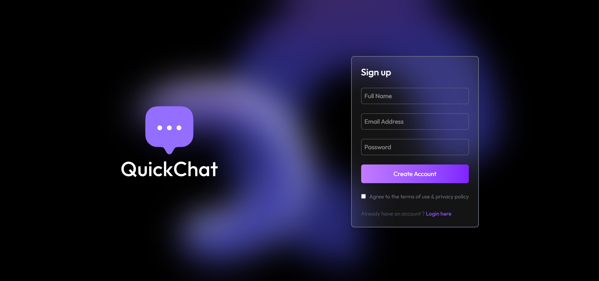
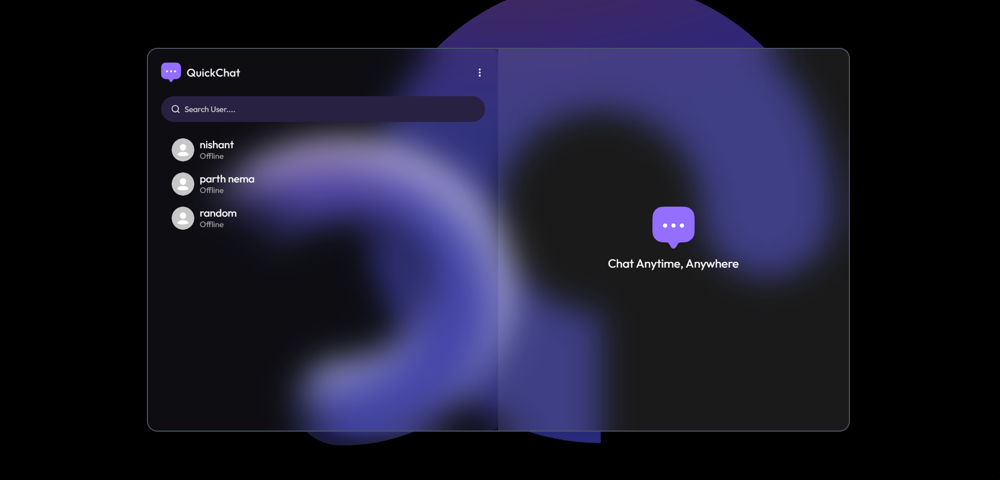

# QuickChat 💬


QuickChat is a **real-time chat application** built with the **MERN** stack and **Socket.IO**, delivering instant bi-directional messaging.  
The app has a **responsive design** for seamless cross-device usage and is **deployed globally on Vercel**.

---

## 🚀 Live Demo
👉 [QuickChat on Vercel](https://quick-chat-gamma-one.vercel.app/login)

---

## ✨ Features
- ⚡ **Real-Time Messaging** with Socket.IO  
- 🔄 **Bi-directional Communication** (no page reloads)  
- 📱 **Responsive UI** (works across desktop & mobile)  
- 🌍 **Globally Accessible** (deployed on Vercel)  
- 🛠️ Built with **MongoDB, Express.js, React.js, Node.js**  

---

## 🛠️ Tech Stack
- **Frontend:** React.js, HTML, CSS, JavaScript  
- **Backend:** Node.js, Express.js  
- **Database:** MongoDB  
- **Real-Time Communication:** Socket.IO  
- **Hosting:** Vercel  

---

## 📸 Screenshots  

<details>
  <summary>🔐 Login Page</summary>
  <br>
  <p align="center">
    
  </p>
</details>

<details>
  <summary>💬 Chat Interface</summary>
  <br>
  <p align="center">
    
  </p>
</details>

---

## 👨‍💻 Author

- **Nishant Rajwal**  
  📧 [nishantrajwal@gmail.com]  
  🔗 [GitHub](https://github.com/nishantrajwal) | [LinkedIn](https://www.linkedin.com/in/nishant-rajwal-9bb5a7342/)  

---

## ⚙️ Installation & Setup

Run the project locally by following these steps:

```bash
# Clone the repository
git clone https://github.com/nishantrajwal/QuickChat.git
cd QuickChat

# Backend setup
cd server
npm install
npm start

# Frontend setup
cd ../client
npm install
npm start


